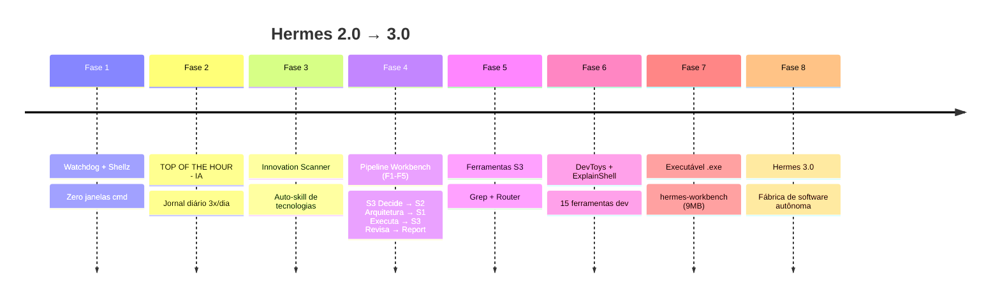

# 🏭 Hermes 3.0 — Software Factory
> Evolução do Workbench Hermes: de watchdog a fábrica de software autônoma

---

## 📜 Índice da Evolução



---

## 🟢 FASE 1: Fundação — Watchdog + Shellz

**Problema:** Hermes travava por 65min sem ninguém perceber. Janelas cmd abriam sem parar.

### Watchdog 24/7

| Iteração | Arquivo | Problema | Solução |
|----------|---------|----------|---------|
| 1 | `watchdog_hermes.bat` | .bat abre cmd.exe VISÍVEL | ❌ |
| 2 | Cron `hermes cron` a cada 1min | cron roda python.exe → CONSOLE | ❌ |
| 3 | `watchdog_guardian.py` | python.exe = console mode | ❌ |
| 4 | `watchdog_invisible.vbs` | `pythonw.exe` sem PATH absoluto | ❌ |
| 5 | `watchdog_invisible.vbs` v2 + `watchdog_hermes.py` | **Caminho ABSOLUTO + pythonw** | ✅ |

```
LIÇÃO: Windows. pythonw.exe ≠ python.exe.
        python.exe = console (abre janela).
        pythonw.exe = GUI (zero janelas).
        VBS precisa de PATH ABSOLUTO.
        CRON no Windows abre janela — NUNCA usar.
```

**Arquivos criados:**
- `D:\projetos\hermes-watchdog\watchdog_hermes.py` — Watchdog em Python
- `D:\projetos\hermes-watchdog\watchdog_invisible.vbs` — VBS guardian com loop

### Shellz — Controle do Ollama

**Shellz Tray Icon:** Ícone na bandeja do Windows com 3 cores:
- 🟢 Verde = Ollama rodando
- 🟠 Laranja = Pausado (GPU livre)
- ⚫ Cinza = Parado

**Menu Shellz:** Interface batch para pausar/retomar Ollama

**Bug crítico encontrado:** Label `:check_status` ausente → erro "rótulo não encontrado"
- `nvidia-smi` sem proteção → crashava o menu

**Arquivos criados:**
- `shellz_menu.bat` — Menu interativo
- `shellz_tray.ps1` — Ícone de bandeja
- `shellz_tray_guardian.vbs` — Guardian do tray
- `shellz_pausar.bat` / `shellz_retomar.bat` — Atalhos

---

## 🟡 FASE 2: TOP OF THE HOUR — IA (Jornal Diário)

**Jornal de IA 3x/dia** (07:00, 13:00, 19:00)

**Estrutura:**
```
Cascade: Hardware → Arquitetura → Apps → Estratégia
26 fontes de IA, 212 modelos catalogados
HTML único com abas cronológicas
Ticker ao vivo, radar de fontes, dark theme
```

**Automação:**
- Cron job: `0 7,13,19 * * *`
- Skill: `index-news-daily`
- Innovation Scanner: 15min após cada edição

**Arquivos:**
- `D:\projetos\TOP OF THE HOUR - IA\index.html`

---

## 🟠 FASE 3: Innovation Scanner (Auto-Skill)

**Scanner automático** que detecta tecnologias nas notícias do jornal e cria skills Hermes automaticamente.

**Skills geradas automaticamente:**
- `vibevoice`, `agent-reach`, `mempalace`
- `opencv-5`, `apache-burr`, `cohere-coding-agent`
- `harness-1`, `open-notebook`, `roboflow-supervision`
- `diffusiongemma`, `taste-skill`, `openenv`
- `skillopt`, `olmo-eval`, `mimo-code`
- `serge-code-review`, `open-llm-vtuber`, `nemotron-35-asr`

**Cron:** `15 7,13,19 * * *` (15min após o jornal)

---

## 🔴 FASE 4: Pipeline Workbench (F1-F5)

**O coração da fábrica de software.** Pipeline OBRIGATÓRIO para toda solicitação.

```
🧠 F1: S3 DECIDE       → DECISION_PACKAGE (deepseek-pro ☁️ $0.50/M)
🏗️  F2: S2 ARQUITETA   → ARCHITECTURE.md (deepseek-v4-flash ☁️ $0.15/M)
⚙️  F3: S1 EXECUTA     → Código + Testes (Ollama local 🆓 $0,00)
🔍  F4: S3 REVISA      → Quality Gate (loop F2→F3→F4, máx 3)
📊  F5: RELATÓRIO      → Report + git commit
```

**Regras de Ouro (não negociáveis):**
1. Toda solicitação começa com DECISION_PACKAGE
2. S1 é SEMPRE local/Ollama para execução
3. NENHUMA entrega sem S3 Review
4. QA Testing com entrada REAL, não teórica
5. Máx 3 ciclos de revisão
6. Relatório de economia S1 em toda resposta
7. Commit ao final de toda entrega

**Quality Gate:** F4 com checklists de 7 itens. Se rejeitado → loop.

**Quando surgiu:** Após 5+ iterações manuais para corrigir uma janela cmd.
O Workbench Mode foi formalizado para NUNCA mais repetir esse loop cego.

---

## 🟣 FASE 5: Ferramentas S3

### S3 Grep (`s3_grep.py`) — busca em 1M+ GitHub repos
Python puro, zero Rust, roda no Windows.

| Função | Descrição | Economia |
|--------|-----------|----------|
| `project_load(path)` | Importa QUALQUER projeto (local ou git) com análise estrutural | -80% pesquisa manual |
| `context_compress(texto)` | Comprime tool outputs (-78% tokens em média) | 50-90% tokens |
| `solution_search(path, q)` | Busca soluções por keyword no código | -60% tempo |
| `project_map(path)` | Mapa em árvore + estatísticas para S3/S2 | -70% análise |

### S3 Grep (`s3_grep.py`)

**grep.app integration** — busca em 1M+ repositórios GitHub.
Via Vercel. Filtros: linguagem, repositório, caminho.

### S1 Router (`s1_router.py`)

**Classificador de tarefas** → S1 (grátis), S2 (cloud leve), S3 (decisão).

```
"criar função python"       → S1 (qwen2.5-coder:7b) $0,00
"pesquisar na web"          → S2 (deepseek-v4-flash) ~$0.15/M
"decidir arquitetura"       → S3 (deepseek-pro) ~$0.50/M
```

---

## 🔵 FASE 6: DevToys + ExplainShell (15 ferramentas)

Inspirado em: CyberChef (35.1k⭐), DevToys (31.6k⭐), ExplainShell (14.1k⭐), JSON Crack (44.1k⭐)

### ExplainShell (🐚 `explain`)
Base de conhecimento: 270+ flags, 30+ comandos (grep, docker, git, find, curl, sed, awk, tar, ssh, systemctl, etc.)

Flags combinadas: `grep -rn` → automaticamente decompõe em `-r` (recursivo) + `-n` (linhas)

### DevToys (🔧 `devtoys`)
12 ferramentas em Python puro:

| Comando | Função |
|---------|--------|
| `hash` | MD5, SHA1, SHA256, SHA512 |
| `jwt-decode` | Decodifica JWT + valida expiração |
| `base64` | Encode/decode Base64 |
| `uuid` | Gera UUID v4 |
| `regex` | Testa regex com contagem de matches |
| `json-format` | Formata JSON com indentação |
| `json-validate` | Valida JSON |
| `lorem` | Gera Lorem Ipsum |
| `diff` | Compara textos com diff colorido |
| `colors` | Paleta de cores ANSI |
| `timestamp` | Converte epoch ↔ data |
| `ip` | Mostra IP local + externo |

### JSON Tree (🌲 `jtree`)
Visualiza JSON/YAML como árvore colorida no terminal:
- `dict` → amarelo
- `list` → azul
- `string` → verde
- `number` → magenta
- `null` → cinza

---

## ⚪ FASE 7: Executável Unificado

**`hermes-workbench.exe`** — 9.1 MB, um único .exe com TUDO.

```
hermes-workbench.exe panorama <path>      Panorama do projeto
hermes-workbench.exe explain "comando"    Explica shell
hermes-workbench.exe devtoys hash "texto" Hash, JWT, base64, regex...
hermes-workbench.exe jtree dados.json     Árvore JSON colorida
hermes-workbench.exe router "tarefa"      Classifica S1/S2/S3
hermes-workbench.exe status               Status do sistema
```

**Build:** `build_exe.bat` (PyInstaller → onefile)

---

## 🏆 FASE 8: Hermes 3.0 — Fábrica de Software

### Arquitetura Atual

```
┌─────────────────────────────────────────────────────────────┐
│                      HERMES 3.0                             │
│               Software Factory Pipeline                     │
├─────────────────────────────────────────────────────────────┤
│                                                              │
│  🧠 S3 (deepseek-pro)    ☁️ $0.50/M                         │
│  ├── DECISION_PACKAGE (F1)                                  │
│  ├── QUALITY GATE (F4) — Aprova/Rejeita + loop             │
│  ├── GREP: busca em 1M+ GitHub repos                       │
│  └── ROUTER: classifica tarefas S1/S2/S3                    │
│                                                              │
│  🗂️  S2 (deepseek-v4-flash) ☁️ ~$0.15/M                     │
│  └── ARCHITECTURE.md (F2)                                   │
│                                                              │
│  ⚙️  S1 (Ollama local)      🖥️ $0,00 🆓                     │
│  ├── EXECUÇÃO (F3) — código + testes                        │
│  ├── EXPLAINSHELL — valida comandos                         │
│  ├── DEVTOYS — 12 ferramentas dev                           │
│  └── JTREE — visualização de dados                          │
│                                                              │
│  🛠️  S0 (Python local)     🖥️ $0,00 🆓                     │
│  └── execute_code — testes, validação                       │
│                                                              │
│  🔧 INFRAESTRUTURA                                          │
│  ├── Watchdog 24/7 (VBS guardian + pythonw, zero janelas)   │
│  ├── Shellz Tray (ícone bandeja, pause GPU)                 │
│  ├── TOP OF THE HOUR - IA (jornal 3x/dia)                   │
│  ├── Innovation Scanner (auto-skill)                         │
│  └── Fallback: S3 se S2 falhar                              │
│                                                              │
│  📦 DISTRIBUIÇÃO                                            │
│  ├── hermes-workbench.exe (9 MB, CLI completa)              │
│  └── GitHub: github.com/guilhermecrepaldi/hermes-2.0        │
│                                                              │
├─────────────────────────────────────────────────────────────┤
│  🚀 PRÓXIMOS PASSOS (gaps identificados)                    │
├─────────────────────────────────────────────────────────────┤
│  1. Batch + Select (gerar N soluções, S3 escolhe melhor)     │
│  2. start.bat + update.bat (one-click)                       │
│  3. Docker deployment                                        │
│  4. WebUI (interface web)                                    │
│  5. TOML config pattern                                      │
└─────────────────────────────────────────────────────────────┘
```

### Economia do S1 (desde o início)

| Shell | Modelo | Custo | Uso |
|-------|--------|-------|-----|
| ⚙️ S1 | Ollama local 🆓 | $0,00 | Execução, código, testes |
| ☁️ S2 | deepseek-v4-flash | ~$0.15/M | Arquitetura, análise |
| 🧠 S3 | deepseek-pro | ~$0.50/M | Decisão, revisão |

**Estimativa de economia:** ~40-60% vs fazer tudo na cloud.

### Skills Instaladas

```
workbench-mode        → Pipeline obrigatório (prioridade 999)
workbench-benchmark   → Artefato de performance
workbench-pipeline    → Orquestração multi-shell
index-news-daily      → Jornal TOP OF THE HOUR
innovation-scanner    → Auto-detect de tecnologias
shellz               → Controle do Ollama
+(60+ outras skills)  →
```

---

## 📊 Timeline Completa

```
Data       | Evento
-----------|--------------------------------------------------------------
[~01/06]   | TOP OF THE HOUR - IA criado (jornal diário 3x/dia)
[~05/06]   | Watchdog .bat inicial (loop 5min)
[~05/06]   | Cron guardian a cada 1min (abria janela cmd)
[10/06]    | Shellz Tray + Menu criados
[10/06]    | Innovation Scanner implementado
[10/06]    | Watchdog guardian em Python (.py)
[11/06]    | ZERO JANELAS: pythonw + VBS guardian + caminho absoluto
[11/06]    | Feedback: "janela continua aparecendo" (3x)
[11/06]    | CRON REMOVIDO — causa raiz da janela piscante
[11/06]    | S3 Grep (busca em 1M+ GitHub repos)
[11/06]    | S1 Router (classificador S1/S2/S3)
[11/06]    | Workbench Mode v1: F1-F4 (pipeline)
[11/06]    | Quality Gate: F4 com loop de revisão
[11/06]    | Fallback configurado (deepseek-pro)
[11/06]    | hermes-workbench CLI + .exe (7.9 MB)
[11/06]    | Benchmark 29/29 PASS
[11/06]    | Pipeline OBRIGATÓRIO (prioridade 999)
[11/06]    | Workbench Mode v2: 5 fases + 7 regras de ouro
[12/06]    | v2: ExplainShell (270 flags, 30+ comandos)
[12/06]    | v2: DevToys (12 ferramentas)
[12/06]    | v2: JTree (árvore JSON colorida)
[12/06]    | .exe recompilado (9.1 MB)
[12/06]    | MoneyPrinterTurbo analisado (86.8k ⭐)
[13/06]    | Este documento: HERMES 3.0 — Software Factory
```

---

## 🚀 Visão Hermes 3.0

> **"Uma máquina, um conselho de IAs de proprietários diferentes, onde na mesma pipeline faz tudo o que precisamos: avaliação, re-avaliação, software completo, sem bugs, sem pendências, sem erros."**

### Já temos:
- ✅ Pipeline multi-shell (S3 → S2 → S1 → S3)
- ✅ Quality Gate com loop automático
- ✅ Ferramentas de contexto (Grep)
- ✅ Ferramentas de dev (Explain, DevToys, JTree)
- ✅ Executável unificado (.exe)
- ✅ Zero janelas, watchdog 24/7
- ✅ Fallback entre providers
- ✅ Auto-skill (Innovation Scanner)

### Próximos passos (gaps):
- ⬜ **Batch + Select:** Gerar N soluções, S3 escolhe a melhor
- ⬜ **start.bat + update.bat:** One-click package
- ⬜ **Docker:** `docker-compose up` para deploy
- ⬜ **WebUI:** Interface web para o workbench
- ⬜ **Plugin system:** Fontes de código plugáveis
- ⬜ **MVP generator:** Geração automática de MVPs
- ⬜ **Game generator:** Geração de jogos via pipeline
- ⬜ **Multi-provider council:** Conselho de IAs diferentes

---

> **"O Hermes 2.0 irá ser o 3.0. Uma máquina, um conselho de IAs de proprietários diferentes, onde na mesma pipeline faz tudo o que precisamos, sua avaliação e re-avaliação trará de forma autônoma um software completo, sem bugs, sem pendências, sem erros, ao máximo."**
